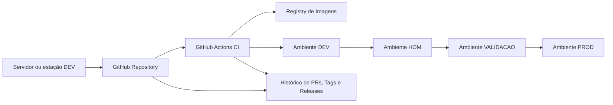

# Arquitetura Alvo - Esteira de Deploy

## 1. Objetivo

Definir a arquitetura alvo da esteira de entrega entre os ambientes de Desenvolvimento, Homologação, Validação e Produção, com promoção controlada, rollback simples e rastreabilidade por versão.

Princípios da arquitetura:

- GitHub é a fonte de verdade do código
- promoção entre ambientes ocorre por commit, tag e artefato versionado
- servidores não são origem de código
- deploy deve ser reproduzível
- rollback deve ser rápido e previsível
- cada promoção precisa deixar evidência de validação

---

## 2. Problema que a arquitetura resolve

Hoje já existe um servidor de homologação funcional, mas o fluxo ainda é predominantemente manual e heterogêneo entre aplicações.

Os principais problemas a resolver são:

- proteção da produção
- redução de deploy manual no host
- padronização entre aplicações
- rastreabilidade do que foi implantado
- criação de gates objetivos entre ambientes

---

## 3. Ambientes alvo

## 3.1 DEV

Objetivo:

- desenvolvimento contínuo
- testes de integração iniciais
- experimentação controlada

Características:

- pode ser ambiente por desenvolvedor ou compartilhado
- aceita maior volatilidade
- pode usar branch `develop`

## 3.2 HOM

Objetivo:

- homologação técnica e funcional interna
- smoke tests
- testes integrados entre sistemas

Características:

- runtime mais próximo do ambiente final
- sem debug aberto ao público
- NGINX, TLS e política de portas já endurecidos

## 3.3 VALIDACAO

Objetivo:

- validação do usuário ou área responsável
- aprovação formal para promoção final

Características:

- ambiente por aplicação ou conjunto de aplicações
- acesso controlado
- deve receber apenas versões já homologadas

## 3.4 PROD

Objetivo:

- operação final de negócio

Características:

- aprovação explícita
- telemetria obrigatória
- rollback obrigatório
- menor superfície de mudança possível

---

## 4. Fluxo alvo de promoção

Fluxo lógico recomendado:

```text
Developer Workstation
  -> GitHub (push / PR)
  -> CI (build, test, lint, image)
  -> Deploy DEV
  -> Aprovação técnica
  -> Tag candidata de release
  -> Deploy HOM
  -> Aprovação funcional interna
  -> Promoção da mesma release
  -> Deploy VALIDACAO
  -> Aprovação do solicitante
  -> Promoção da mesma release
  -> Deploy PROD
```

Ponto central:

- a mesma versão deve ser promovida entre ambientes
- não deve haver rebuild arbitrário entre HOM, VALIDACAO e PROD

---

## 5. Estratégia de branches e tags

## 5.1 Branches

Modelo recomendado:

- `main`: linha estável e pronta para release
- `develop`: integração contínua das features
- `feature/<nome>`: desenvolvimento isolado
- `hotfix/<nome>`: correção urgente em produção

Regras:

1. `feature/*` abre PR para `develop`
2. `develop` pode acionar deploy automático em DEV
3. merge validado de `develop` para `main` prepara release
4. deploy em HOM, VALIDACAO e PROD deve ocorrer a partir de tag versionada em `main`

## 5.2 Tags

Formato recomendado:

- `vYYYY.MM.DD.N`

Exemplos:

- `v2026.03.20.1`
- `v2026.03.20.2`

Alternativa aceitável:

- `v1.4.0`
- `v1.4.1`

Regra principal:

- a tag implantada em HOM deve ser exatamente a mesma promovida para VALIDACAO e PROD

---

## 6. Artefatos promovidos

Cada aplicação deve gerar artefatos imutáveis por versão.

Ordem de preferência:

1. imagem Docker versionada em registry
2. pacote versionado se a aplicação não usar container
3. manifesto de deploy versionado

Modelo recomendado para containerização:

- imagem: `ghcr.io/<org>/<repo>:<tag>`
- imagem adicional: `ghcr.io/<org>/<repo>:main` ou `:develop` para conveniência operacional

Regra:

- DEV pode consumir imagens de branch
- HOM, VALIDACAO e PROD devem consumir imagem versionada por tag

---

## 7. Gates por ambiente

## 7.1 Gate para DEV

Obrigatório:

- lint
- build
- testes unitários mínimos
- deploy automático concluído
- smoke test básico

## 7.2 Gate para HOM

Obrigatório:

- imagem criada a partir de tag ou release candidate
- aprovação técnica
- healthcheck e smoke test
- validação de integração com dependências reais do ambiente
- evidência de versão implantada

## 7.3 Gate para VALIDACAO

Obrigatório:

- mesma tag aprovada em HOM
- checklist funcional da aplicação
- aprovação manual do responsável de negócio ou usuário validador
- evidência de testes executados

## 7.4 Gate para PROD

Obrigatório:

- mesma tag validada em VALIDACAO
- backup pré-deploy quando aplicável
- plano de rollback documentado
- aprovação manual final
- smoke test pós-deploy
- monitoramento ativo após liberação

---

## 8. Estratégia de rollback

Rollback deve ocorrer por reimplantação do último artefato estável, não por edição manual do servidor.

Modelo recomendado:

1. manter registro da última tag estável em cada ambiente
2. em caso de falha, redeploy da tag anterior
3. validar healthcheck
4. registrar incidente e causa

Exemplo operacional:

```text
Release atual em PROD: v2026.03.20.3
Última estável conhecida: v2026.03.19.2
Rollback = redeploy de v2026.03.19.2
```

Não recomendado:

- editar containers manualmente em produção
- mudar código direto no host
- usar `git pull` manual como mecanismo principal de rollback

---

## 9. Visão por perfil solicitado

## 9.1 Software Architect

Decisão arquitetural:

- centralizar promoção no GitHub
- versionar o artefato implantável
- manter o mesmo artefato entre HOM, VALIDACAO e PROD

ADR implícita:

- servidores deixam de ser origem de deploy manual e passam a ser alvos de uma promoção controlada

## 9.2 Security Architect

Decisões:

- GitHub Environments com aprovação manual
- secrets segregados por ambiente
- deploy sem expor portas desnecessárias
- acesso administrativo restrito ao host

## 9.3 Data Architect

Decisões:

- política específica de dados por ambiente
- backup obrigatório antes de mudanças destrutivas
- validação de migração de schema por versão

## 9.4 DevOps Engineer

Decisões:

- GitHub Actions como orquestrador principal
- build e publicação de imagem em registry
- deploy remoto via SSH ou runner self-hosted controlado

## 9.5 Cloud Architect

Decisões:

- baseline do host e da configuração devem ser versionados
- idealmente NGINX, UFW, diretórios e provisionamento devem ser reproduzíveis por IaC ou automação de bootstrap

## 9.6 SRE

Decisões:

- healthcheck obrigatório por aplicação
- observabilidade mínima antes de produção
- rollback e runbooks padronizados

## 9.7 Monitoring

Decisões:

- monitorar disponibilidade HTTP/HTTPS
- monitorar containers, CPU, memória e disco
- monitorar falhas de deploy e taxa de erro

## 9.8 Incident Response

Decisões:

- incidente deve apontar tag, horário, executor e ambiente
- rollback deve ser preferencialmente automático ou de um clique

## 9.9 Product Improvement

Decisões:

- gates funcionais por aplicação
- aprovação explícita antes de produção
- ciclo de aprendizado pós-release

---

## 10. Topologia lógica sugerida



Leitura:

- GitHub centraliza código, tags e auditoria
- CI gera artefato imutável
- ambientes consomem versões aprovadas

---

## 11. Decisões objetivas para padronização

1. O deploy em DEV pode ser disparado por merge em `develop`.
2. O deploy em HOM deve ser disparado por tag criada em `main`.
3. VALIDACAO e PROD devem promover a mesma tag, sem rebuild.
4. O servidor de homologação deve convergir para o padrão `127.0.0.1 + NGINX`.
5. O rollback deve ser por tag anterior estável.
6. Cada aplicação deve ter checklist mínimo e smoke test próprio.

---

## 12. Riscos que a arquitetura ainda depende de resolver

1. Confirmar IP e topologia real dos ambientes futuros.
2. Definir se VALIDACAO e PROD serão hosts dedicados por aplicação ou compartilhados.
3. Definir registry padrão para imagens.
4. Definir mecanismo de deploy remoto:
   - SSH direto
   - runner self-hosted
   - pull-based deploy
5. Definir gestão de secrets por ambiente.

---

## 13. Resultado esperado desta arquitetura

Ao final da implementação:

- cada versão implantada será rastreável
- homologação, validação e produção usarão a mesma release
- rollback ficará simples e objetivo
- deploy manual no host será reduzido ao mínimo
- o risco de divergência entre ambientes será significativamente menor